---
hide:
  - navigation
---

# Conference Program

The final conference program schedule is provided as below; you can also download the pdf version of the schedule [here](image/index/1724074529603.pdf).

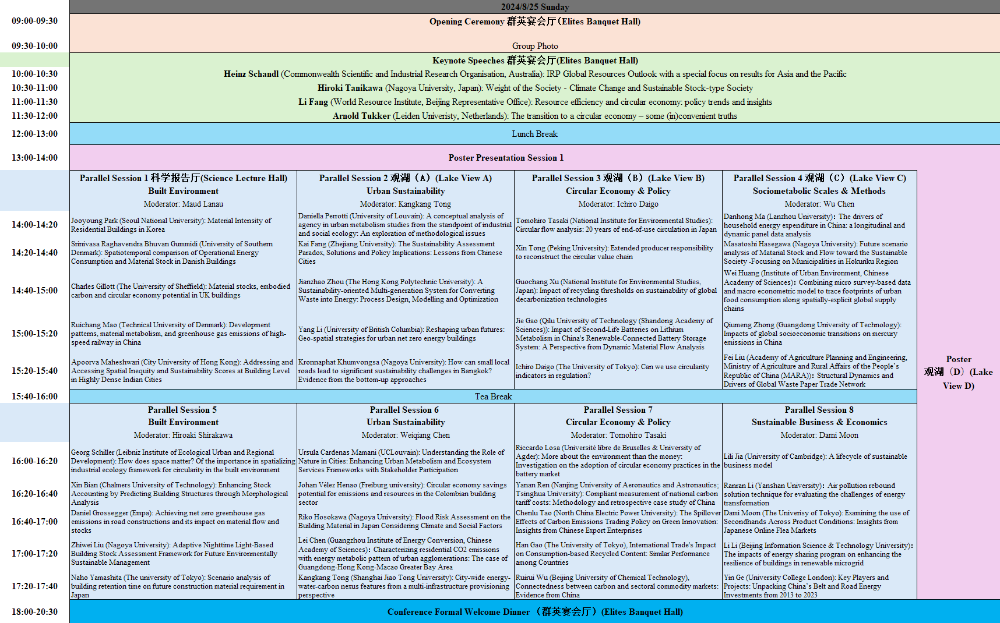

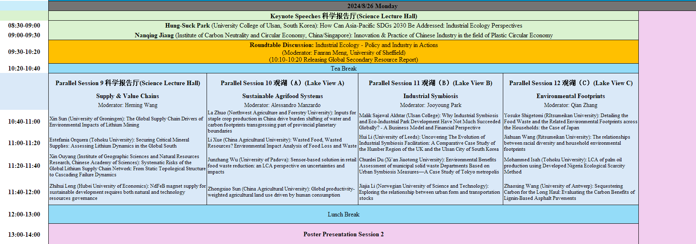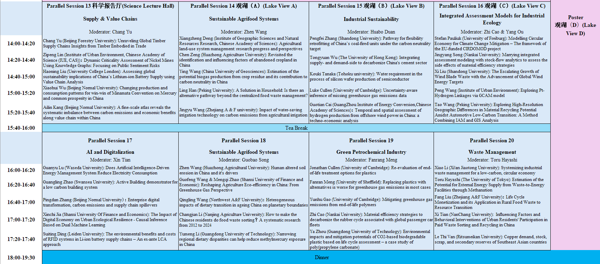

## Poster Presentation Arrangement

We have arranged the poster presentations into 3 days. Please check the detailed arrangement below or download the pdf version of the schedule [here](image/index/1724074529603.pdf).

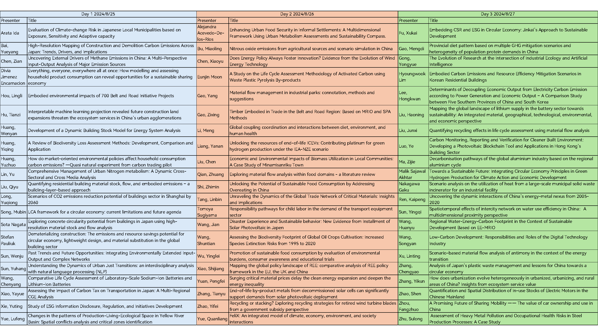

## Keynote Speakers

### Dr. Heinz Schandl

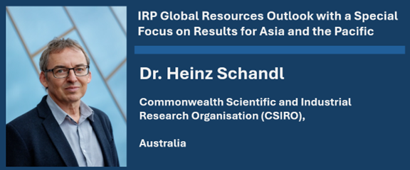

### Prof. Hiroki Tanikawa

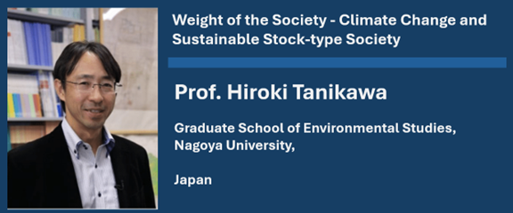

### Dr. Li Fang

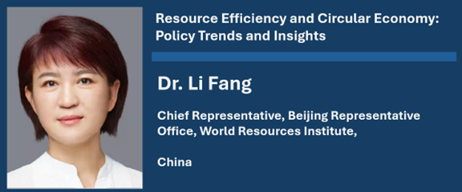

### Prof. Arnold Tukker

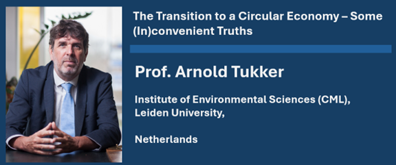

### Prof. Hung-Suck Park

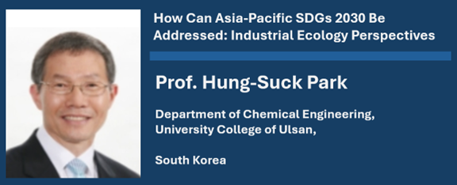

### Dr. Nanqing Jiang

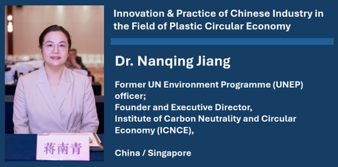

### Prof. Yonglong Lu

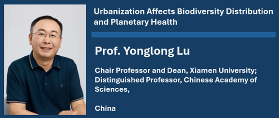

### Dr. Yang Xia

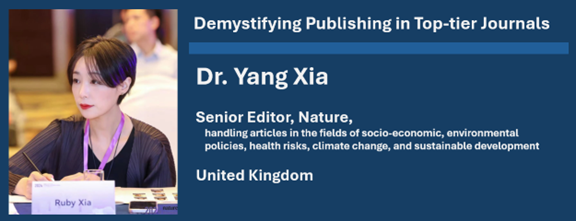
