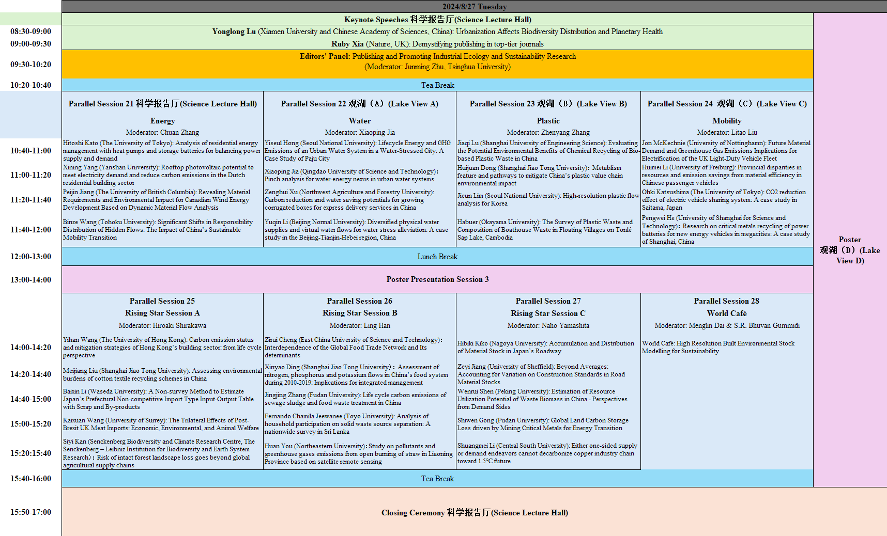

---
hide:
  - navigation
---

# Conference Program

The final conference program schedule is provided as below; you can also download the pdf version of the schedule [here](image/index/1724074529603.pdf).

Detailed schedule of poster presentation:

## Keynote Speakers

### Dr. Heinz Schandl

### Prof. Hiroki Tanikawa

### Dr. Li Fang

### Prof. Arnold Tukker

### Prof. Hung-Suck Park

### Dr. Nanqing Jiang

### Prof. Yonglong Lu

### Dr. Ruby Xia

