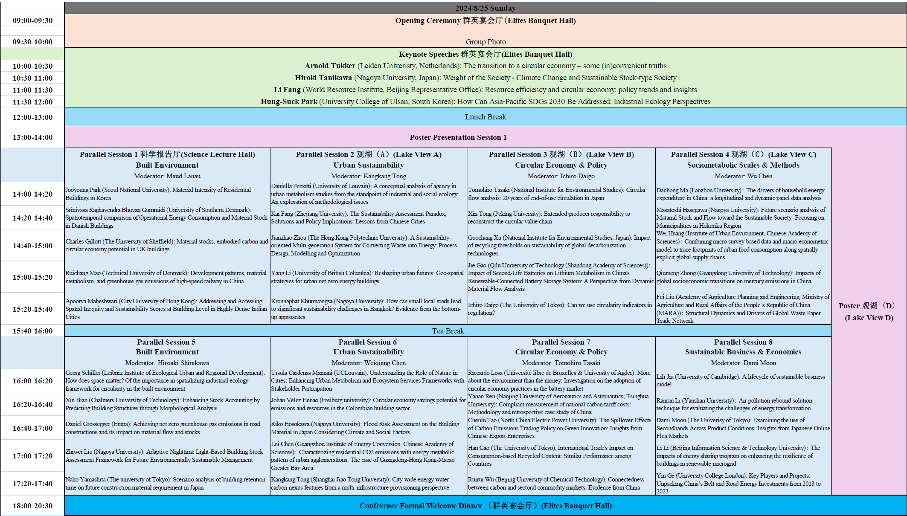
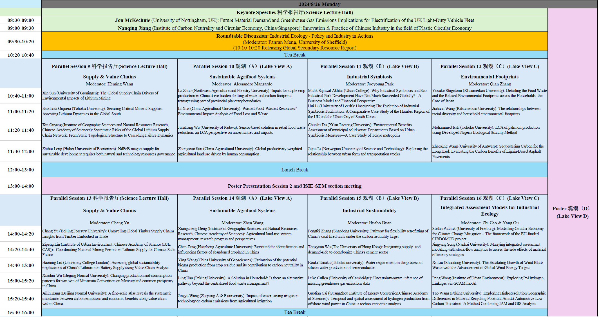
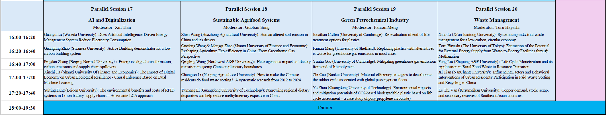
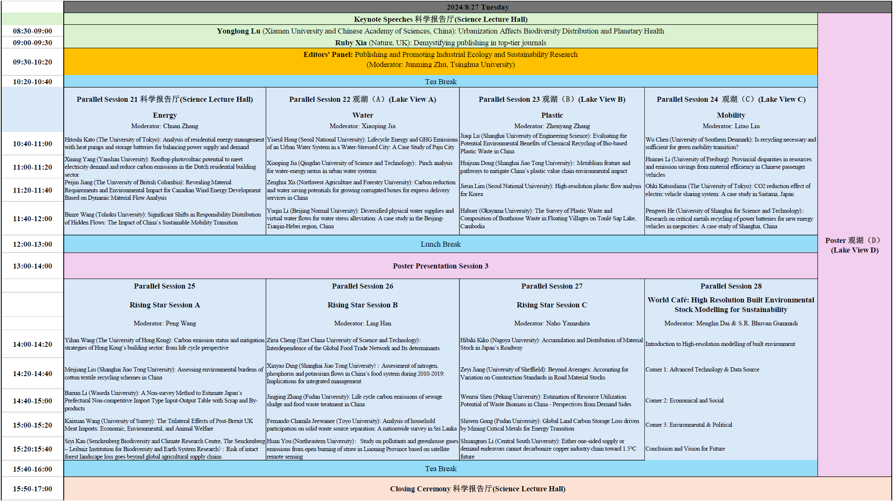
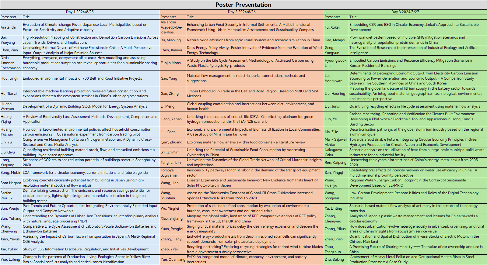

---
hide:
  - navigation
---

# Conference Program

## The conference program handbook is out now! Download the PDF version by clicking [here](image/index/1724377000328.pdf).

Detailed schedule of poster presentation:

## Keynote Speakers

### Prof. Arnold Tukker

### Prof. Hiroki Tanikawa

### Dr. Li Fang

### Prof. Hung-Suck Park

### Prof. Jon McKechnie

### Dr. Nanqing Jiang

### Prof. Yonglong Lu

### Dr. Ruby Xia

