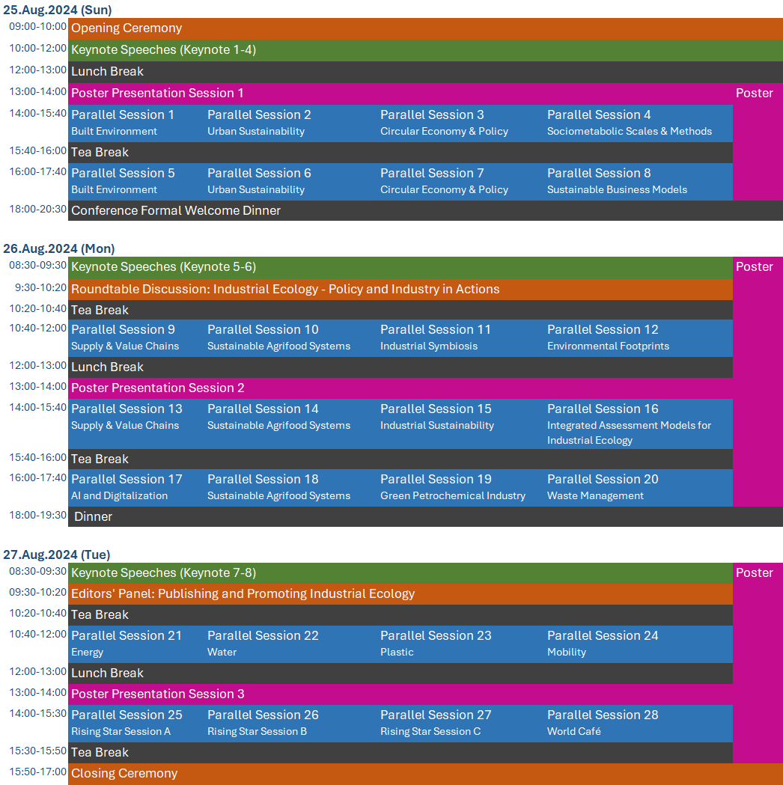
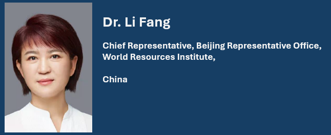
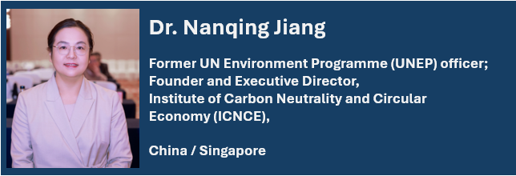
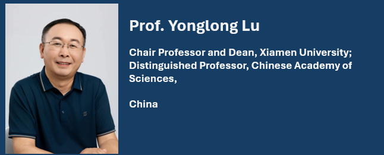
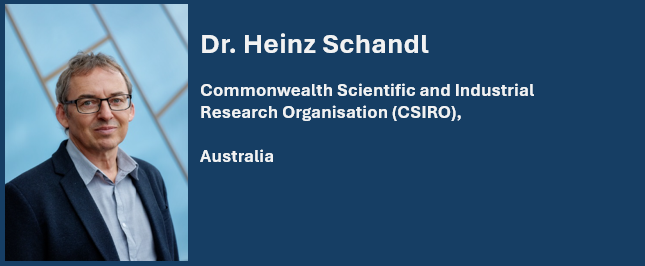
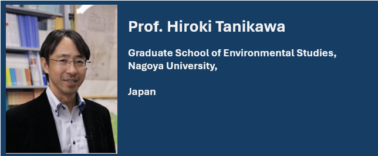
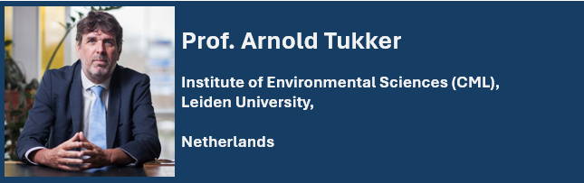
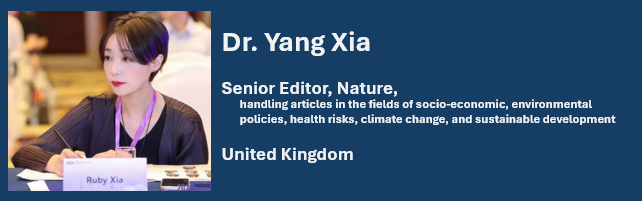

---
hide:
  - navigation
---

# Conference Program

The conference program is out now! The schedule during the conference is provided as follows (please note that minor changes may still occur):

## Keynote Speakers

### Dr. Li Fang

### Dr. Nanqing Jiang

### Prof. Yonglong Lu

### Prof. Hung-Suck Park

### Dr. Heinz Schandl

### Prof. Hiroki Tanikawa

### Prof. Arnold Tukker

### Dr. Yang Xia

