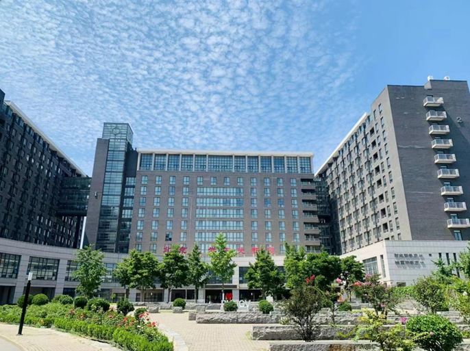
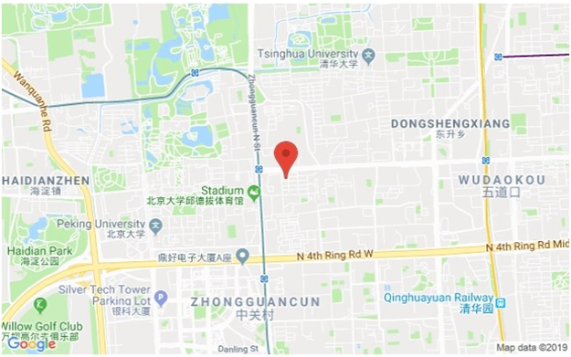
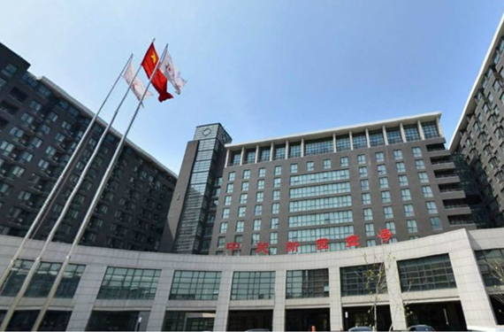

# Venue & Travel

## Conference Venues Locations

### Zhongguanyuan Global Village PKU Beijing

Zhongguan Xinyuan Global Village PKU Beijing is located in Zhongguancun North Street, near entrance C of Peking University East Gate Station of Metro 4, and adjacent to Peking University, Tsinghua University, summer palace and Zhongguancun business district.

- Address: 126 Zhongguancun North Street, near entrance C of Peking University East Gate Station of Metro 4

    

- Tel: +86-10-62752288
- Fax: +86-10-62752870

## Travel Directions

### Capital Airport

1. By taxi: 40 minutes (approximately 33 kilometers)
2. By public transport:
    - Take Airport Bus Line 5 (Zhongguancun Line) to the terminal station "Zhongguancun" station. Walk east for about 100 meters, transfer to Bus 696 or 498 at "Baofusiqiao West" station, and take two stops to reach "Zhongguanyuan" station. It takes about 1 hour and 15 minutes.
    - Take Airport Bus Line 4 (Princess Tomb Line) to "Youyi Hotel" station. Walk east for about 150 meters, transfer to Metro Line 4 (Renmin University Station) to "Peking University East Gate" station. Walk south for 100 meters from exit C to reach the northwest gate of Zhongguan Xinyuan. It takes about 1 hour and 15 minutes.

### Daxing Airport

1. By taxi: 1 hour (approximately 60 kilometers)
2. By public transport:
    - Take the Airport Shuttle Bus Zhongguancun Line to the “Zhongguancun” station, walk approximately 1.1 koilometers to reach Zhongguanyuan Global Village. It takes about 1.5 hours.

### Beijing South Station

1. By taxi: 45 minutes (approximately 21 kilometers)
2. By public transport:
    - Take Metro Line 4 from "Beijing South Station" to "Peking University East Gate" station. Walk 100 meters south from exit C to reach the northwest gate of Zhongguan Xinyuan. It takes about 50 minutes.

### Beijing West Station

1. By taxi: 30 minutes (approximately 15 kilometers)
2. By public transport:
    - Take Metro Line 9 from "Beijing West Station" to "National Library" station. Transfer to Metro Line 4 to "Peking University East Gate" station. Walk 100 meters south from exit C to reach the northwest gate of Zhongguan Xinyuan. It takes about 45 minutes.
    - Take Bus 320 or Special Bus 6 from Beijing West Station to "Zhongguanyuan" station. It takes about 1 hour and 15 minutes.

### Beijing Station

1. By taxi: 50 minutes (approximately 21.5 kilometers)
2. By public transport:
    - Take Metro Line 2 from "Beijing Station" and transfer to Metro Line 4 at "Xizhimen" station to "Peking University East Gate" station. Walk 100 meters south from exit C to reach the northwest gate of Zhongguan Xinyuan. It takes about 1 hour.

### Beijing North Station

1. By taxi: 20 minutes (approximately 11.5 kilometers)
2. By public transport:
    - Take Metro Line 4 from "Xizhimen" station to "Peking University East Gate" station. Walk 100 meters south from exit C to reach the northwest gate of Zhongguan Xinyuan. It takes about 30 minutes.
    - Take Bus 105 from Xizhimen to "Zhongguanyuan" station. It takes about 1 hour.

## Accommodation

We selected some hotels which you can book for your stay during the conference. Timely reservation is advised. Please note the costs for the hotel are at your own expense.

### Zhongguanyuan Global Village PKU Beijing

Zhongguan Xinyuan Global Village PKU Beijing is located in Zhongguancun North Street, near entrance C of Peking University East Gate Station of Metro 4, and adjacent to Peking University, Tsinghua University, summer palace and Zhongguancun business district.

It is an important part for Peking University to build a world-class university. It is a comprehensive park integrating accommodation, catering, conference, teaching and recreational services. It has expert apartments, international students apartments, postdoctoral apartments and a star hotel.

- Address: 126 Zhongguancun North Street, near entrance C of Peking University East Gate Station of Metro 4
- Hotel Reservation Telephone:  010-62752288
- Website: http://www.globalvillagepku.com/

#### Zhongguanyuan Global Village PKU Beijing (Villa 1)

The venue is located within the hotel.

Price per night, per person/room from 658 RMB --, including breakfast

#### Zhongguanyuan Global Village PKU Beijing (No. 9 building)

Distance to the conference venue: 300 meters, a 5-minute walk to the venue 

Price per night, per person/room from 558 RMB --, including breakfast

### The Lakeview Hotel Beijing

Located in the Zhongguancun, often referred to as "China's Silicon Valley," The Lakeview Hotel Beijing (Beida Boya Guoji Huiyi Zhongxin) is situated close to famous Beijing attractions including Yuanming Yuan and the Summer Palace. On offer in The Lakeview Hotel Beijing are a great variety of rooms.

- Address: No. 127 Zhongguancun North Street, Haidian District, Beijing
- Distance to the conference venue: 1000 meters, a 15-minute walk to the venue
- Price per night, per person/room from 1056RMB --, including breakfast
- Hotel Reservation Telephone: +8620-86007566

### Wenjin Hotel Beijing

Wenjin Hotel Beijing(Beijing Wenjin Guoji Jiudian), located in Tsinghua Science & Tech Park, is in the heart of Zhongguancun, known as the Silicon Valley of China. Bordering Tsinghua University in the north and Peking University in the west, this Beijing hotel is minutes from Summer Palace, Yuanming Garden and a dozen well-known multinational companies' headquarters in China. 

- Distance to the conference venue: 778 meterrs, a 11-minute walk to the venue
- Address: Building 5, No. 1 Courtyard, Zhongguancun East Road, Haidian District, Beijing
- Price per night, per person/room from1200RMB --, including breakfast
- Hotel Reservation Telephone: +8620-86007566
