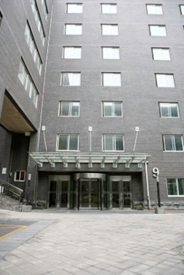

# Venue & Travel

## English Version

### Conference Venues Locations

#### Zhongguanyuan Global Village PKU Beijing

Zhongguan Xinyuan Global Village PKU Beijing is located in Zhongguancun North Street, near entrance C of Peking University East Gate Station of Metro 4, and adjacent to Peking University, Tsinghua University, summer palace and Zhongguancun business district.

- Address: 126 Zhongguancun North Street

    <iframe src="https://www.google.com/maps/embed?pb=!1m18!1m12!1m3!1d10814.279868491565!2d116.30784174159498!3d39.9940337908355!2m3!1f0!2f0!3f0!3m2!1i1024!2i768!4f13.1!3m3!1m2!1s0x35f056ac64b7cf1d%3A0x63d6bea0b79d68c7!2sZhongguan%20Xinyuan%20Global%20Village%20PKU!5e0!3m2!1sen!2sus!4v1706670614804!5m2!1sen!2sus" width="600" height="450" style="border:0;" allowfullscreen="" loading="lazy" referrerpolicy="no-referrer-when-downgrade"></iframe>

- Tel: +86-10-62752288
- Fax: +86-10-62752870

### Travel Directions

**We recommend you to take the subway or a taxi for your transportation.**

The venue is near **entrance C of Peking University East Gate Station of Metro 4**, you can reach it by heading south 100 meters from Exit C. Information on subway transfers can be found on the Beijing Subway website: [https://www.bjsubway.com/en/](https://www.bjsubway.com/en/).

**The distances and estimated costs from the airport or train stations to the conference venue (prices subject to change):**

- Beijing Capital International Airport: 33 kilometers, by taxi: 50 minutes, 110 RMB.
- Beijing Daxing International Airport: 60 kilometers, by taxi: 60 minutes, 150 RMB.
- Beijing South Railway Station: 21 kilometers, by taxi: 45 minutes, 63 RMB.
- Beijing West Railway Station: 15 kilometers, by taxi: 30 minutes, 50 RMB.
- Beijing Railway Station: 21.5 kilometers, by taxi: 50 minutes, 70 RMB.
- Beijing North Railway Station: 11.5 kilometers, by taxi: 20 minutes, 35 RMB

### Accommodation

The **Zhongguan Xinyuan Global Village PKU Beijing hotel set aside a block of rooms for the conference attendees**, with 100 rooms in Villa 1 and 100 rooms in Building No. 9.

When booking, **please mention your participation in the ISIE SEM and Asia-Pacific Conference to access the conference discount. We recommend making your reservation in a timely manner.** Kindly be aware that the hotel expenses are to be covered by yourself.

#### Zhongguan Xinyuan Global Village PKU Beijing

Zhongguan Xinyuan Global Village PKU Beijing is located in Zhongguancun North Street, near entrance C of Peking University East Gate Station of Metro 4, and adjacent to Peking University, Tsinghua University, summer palace and Zhongguancun business district.

It is an important part for Peking University to build a world-class university. It is a comprehensive park integrating accommodation, catering, conference, teaching and recreational services. It has expert apartments, international students apartments, postdoctoral apartments and a star hotel.

- Address: 126 Zhongguancun North Street, near entrance C of Peking University East Gate Station of Metro 4
- Hotel Reservation Telephone: +86-10-62752288
- Website: http://www.globalvillagepku.com/

##### Zhongguan Xinyuan Global Village PKU Beijing (Villa 1)

The venue is located within the hotel.

Price per night, per person/room from 658 RMB --, including breakfast

##### Zhongguan Xinyuan Global Village PKU Beijing (No. 9 building)

Distance to the conference venue: 300 meters, a 5-minute walk to the venue

Price per night, per person/room from 558 RMB --, including breakfast

**We also selected some hotels near the venue which you can book during the conference.**

#### The Lakeview Hotel Beijing

Located in the Zhongguancun, often referred to as "China's Silicon Valley," The Lakeview Hotel Beijing (Beida Boya Guoji Huiyi Zhongxin) is situated close to famous Beijing attractions including Yuanming Yuan and the Summer Palace. On offer in The Lakeview Hotel Beijing are a great variety of rooms.

- Address: No. 127 Zhongguancun North Street, Haidian District, Beijing
- Distance to the conference venue: 1000 meters, a 15-minute walk to the venue
- Price per night, per person/room from 1056RMB --, including breakfast
- Hotel Reservation Telephone: +86-20-86007566

#### Wenjin Hotel Beijing

Wenjin Hotel Beijing(Beijing Wenjin Guoji Jiudian), located in Tsinghua Science & Tech Park, is in the heart of Zhongguancun, known as the Silicon Valley of China. Bordering Tsinghua University in the north and Peking University in the west, this Beijing hotel is minutes from Summer Palace, Yuanming Garden and a dozen well-known multinational companies' headquarters in China.

- Distance to the conference venue: 778 meterrs, a 11-minute walk to the venue
- Address: Building 5, No. 1 Courtyard, Zhongguancun East Road, Haidian District, Beijing
- Price per night, per person/room from 1200RMB --, including breakfast
- Hotel Reservation Telephone: +86-20-86007566

## 中文版本（Chinese version）

### 会场位置

#### 北京大学中关新园

地址： 北京海淀区中关村北大街 126 号（中关村地区，地铁 4 号线“北京大学东门”站，由 C 出口向南 100 米左转即可到达中关新园西北门）

<iframe src="https://www.google.com/maps/embed?pb=!1m18!1m12!1m3!1d10814.279868491565!2d116.30784174159498!3d39.9940337908355!2m3!1f0!2f0!3f0!3m2!1i1024!2i768!4f13.1!3m3!1m2!1s0x35f056ac64b7cf1d%3A0x63d6bea0b79d68c7!2sZhongguan%20Xinyuan%20Global%20Village%20PKU!5e0!3m2!1sen!2sus!4v1706670614804!5m2!1sen!2sus" width="600" height="450" style="border:0;" allowfullscreen="" loading="lazy" referrerpolicy="no-referrer-when-downgrade"></iframe>

### 会场交通

**优先推荐您使用地铁或者出租出行。**

会场位置位于地铁 4 号线“北京大学东门”站附近，由 C 出口向南 100 米即可到达，地铁换乘方法在高德地图、百度地图等导航应用中均有提供。

机场或火车站到达会场的距离和预计费用如下：

- 首都机场：乘坐出租车直达约需费用：110 元（全程约 33 公里，50 分钟左右）
- 大兴机场：乘坐出租车直达约需费用：150 元（全程约 60 公里，60 分钟左右）
- 北京南站：乘坐出租车直达约需费用：63 元（全程约 21 公里，45 分钟左右）
- 北京西站：乘坐出租车直达约需费用：50 元（全程约 15 公里，30 分钟左右）
- 北京站：乘坐出租车直达约需费用：70 元（全程约 21.5 公里， 50 分钟左右）
- 北京北站：乘坐出租车直达约需费用：35 元（全程约 11.5 公里，20 分钟左右）

### 住宿信息

我们在会场所在酒店**共预留了 200 间标准间/大床房，其中 1 号楼 100 间，9 号楼 100 间，请您提前预定。**

注意：**预定时说明您为 ISIE SEM and Asia-Pacific 会议参与者可享受会议折扣**，费用自理。

#### 北京大学中关新园（1 号楼）

- 地址：北京海淀区中关村北大街 126 号(上地、中关村地区，地铁 4 号线“北京大学东门”站， 由 C 出口向南 100 米左转即可到达中关新园西北门)
- 费用：标准间 658 元/间（含早）
- 距离：会场所在地
- 酒店咨询电话：010-62752288
- 预订网站：http://hotels.ctrip.com/hotel/128336.html

#### 北京大学中关新园（9 号楼）

- 地址：北京海淀区中关村北大街 126 号(上地、中关村地区， 地铁 4 号线“北京大学东门 ”站， 由 C 出口向南 100 米左转即可到达中关新园西北门)
- 费用：标准间：558 元/间（含早）
- 距离：距主会场约 150 米
- 酒店咨询电话：010-62752288
- 预订网站：http://hotels.ctrip.com/hotel/128336.html

**我们还为您挑选了会场附近的一些酒店，可供您在会议期间预订入住。**

#### 北大博雅国际酒店

- 地址: 北京市海淀区中关村北大街 127 号
- 费用：标准间：1056 元/间（含早）
- 距离：距主会场约 1000 米
- 酒店咨询电话：010-82689999
- 预订网站：http://www.thelakeviewhotel.com.cn/index.php

#### 清华文津酒店

- 地址: 北京市海淀区中关村东路一号院 5 号楼
- 费用：标准间：1200 元/间（含早）
- 距离：距主会场约 778 米
- 酒店咨询电话：010-62525566
- 预订网站：http://www.thelakeviewhotel.com.cn/index.php
