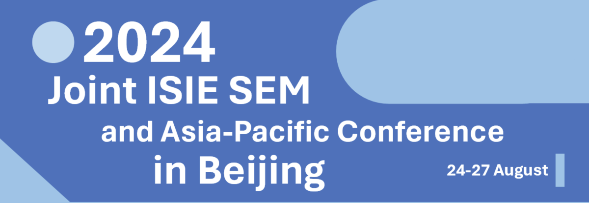

---
hide:
  - navigation
---

## Introduction

On behalf of the Organizing Committee at Peking University and the ISIE-SEM board, it is our great pleasure to invite you to attend the Joint Socio-Economic Metabolism (SEM) Section Conference and the Asia-Pacific (AP) Conference of the International Society for Industrial Ecology (ISIE), to be held 24-27 August 2024 in Beijing, China.

The conference will focus on topics related to both methodological development and sustainability implications of industrial ecology and socio-economic metabolism research, including but not limited to resource efficiency, circular economy, resource security, food systems, built environment, urban metabolism, waste management, climate change mitigation, global value chains, embodied environmental impacts, stock-flow-service nexus, and renewable energy and low-carbon transition. We look forward to welcoming as many of you as possible from the ISIE, ISIE-SEM, and ISIE-AP families. We also aim to bring together researchers from related fields such as geography, urban planning, climate change, and environmental system engineering and practitioners from industry and policy arena.

Please reserve the dates for now and stay tuned for more updates regarding conference details. The conference website for abstract submission will be ready soon, but we already look forward to receiving suggestions for conferences and special session proposals if you have.

## Stay Updated

<!-- This section title has hyperlink in /Program/index.md -->
<!-- 这一部分在 /Program/index.md 中有超链接，注意标题的修改 -->

We provide various ways for you to stay updated with our conference.

- Telegram channel (recommended): [News of 2024 Joint ISIE SEM and Asia-Pacific Conference](https://t.me/isiesem2024)
- WeiXin public account (recommended for Mainland China users):  (PKU RISE)
- Email list: [Subscribe](https://forms.microsoft.com/Pages/ResponsePage.aspx?id=DQSIkWdsW0yxEjajBLZtrQAAAAAAAAAAAAZAAOVphwpUNUI4QjlQUTlWMFBKTlFaWDFLT0g1VFRZQS4u)

## Announcement

1. [2024 Feb] We are collecting the abstract of reports for the conference. Please submit your abstract if you are interested in giving a report. __You can find the submission page in "Programs" section.__

## Important Dates

- 2024 Feb: Abstract submission opens (Deadline TBD; submission page in "Programs" section)