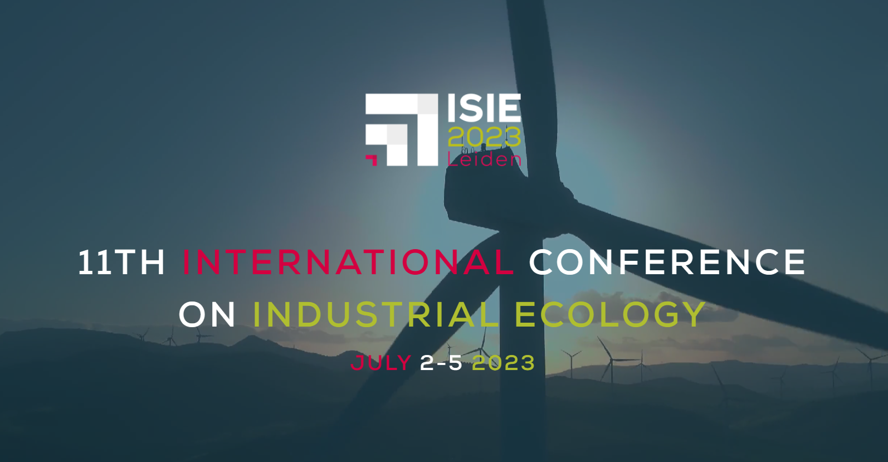
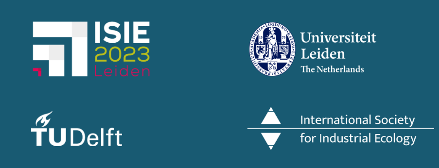
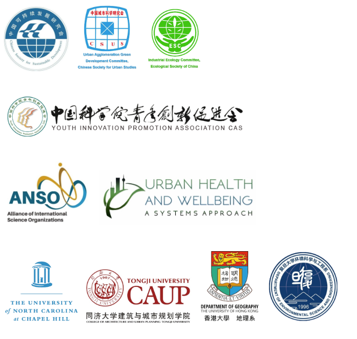

---
hide:
  - navigation
---

# 

（这里也可以放视频，也可以放图片，也可以放动图。视频可能有兼容问题，建议是静态图片。我们的banner似乎好没做好）

## Welcome to the 1st USS conference!

The Urban Science and Sustainability (USS) Conference will bring together leading experts in urban science, sustainability science, sustainable urban system modeling, and other relevant fields to share insights, ideas, and findings that are important for a sustainable urbanized future.

In September 2021, the Institute of Urban Environment, Chinese Academy of Sciences (IUE-CAS) initiated the USS online lecture series, and it has now become an important platform for sharing groundbreaking ideas, innovative solutions, and influential insights in the realm of sustainable development. More than 30 world-renowned experts have been invited to give talks, with each lecture drawing 2000-5000 participants online and the audiences are from more than 45 countries.

Building upon the success of the USS lecture series, IUE-CAS decided to initiate and organize the 1st USS conference, together with the Sustainable Urban System (SUS) section of the International Society for Industrial Ecology (ISIE). This is also the inaugural Section Conference of the ISIE-SUS section. We warmly invite scholars and policymakers from all over the world to join this exciting event. This will be more than just a conference. It will also be a platform for collaboration, a chance to learn from each other, and an opportunity to shape the future of our cities.

## Getting in touch

To receive new information, updates and other announcements, please follow the WeChat official account (preferred for Chinese participants) or XXXXX (preferred for international participants).

## Announcement

Photo Gallery

[https://www.koushare.com/topicIndex/i/USS](https://www.koushare.com/topicIndex/i/USS)

## Important Dates

- October 8, 2023 : Abstract Submission Deadline. Click [here](https://example.com) to submit
- October 20, 2023 : New Deadline for Submitting Abstracts
- November 10, 2023 : Abstract Acceptance Notification
- Stay tuned for more information!

For detailed timeline info, please go to [Timeline section](https://example.com) to check.

## Organizers

## Co-organizers

（到时候会处理真实的logo图片显示问题）

